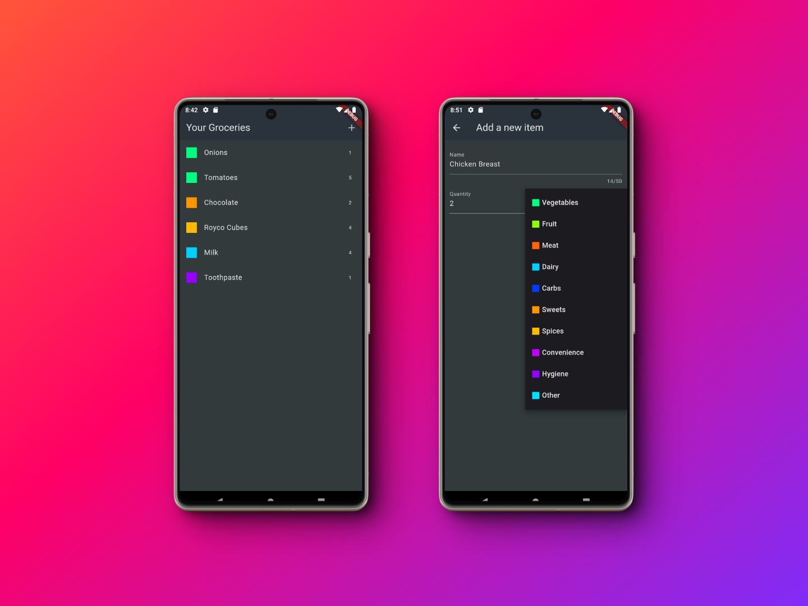

# Flutter Shopping List App

## Overview

The Flutter Shopping List Application is a modern, user-friendly mobile application designed to make shopping easier and more organized. Built with Flutter for the frontend and leveraging Firebase as its backend, this application offers a seamless experience for managing your shopping lists on the go. Whether planning your weekly groceries or organizing a big event, our app is designed to keep your shopping needs well-organized and accessible anytime, anywhere. With the added convenience of HTTP requests for real-time data syncing and the app's hosting on Netlify, users can expect a reliable and smooth performance across all devices.

## Demo

Open the deployed demo [here](https://flutter-shopping-list-app-adala.netlify.app/) on mobile for the best experience.

Explore the app's functionality and user interface through our comprehensive demo. Witness firsthand how effortlessly you can manage your shopping lists with our Flutter application.

## Screenshots

Dive into our visually appealing and intuitive user interface with these screenshots. From the login page to the detailed item addition screen, get a glimpse of what makes our shopping list application stand out.

## Features

- **User-Friendly Interface:** Designed with simplicity and ease of use in mind, our app ensures that managing your shopping lists is straightforward and hassle-free.
- **Real-Time Data Syncing:** Thanks to Firebase backend and HTTP requests, your shopping list is always up to date, allowing for real-time syncing across all your devices.
- **Customizable Shopping Lists:** Tailor your shopping lists to your specific needs by adding items with details such as quantity, category, and item name.
- **Cloud-Hosted Frontend:** With the frontend hosted on Netlify, users can expect fast loading times and a reliable user experience, irrespective of traffic spikes or geographic location.
- **Cross-Platform Compatibility:** Built with Flutter, our app provides a seamless experience whether you're using it on iOS, Android, or web platforms.

## Acknowledgements

This project was inspired by the course ["Learn Flutter & Dart to Build iOS & Android Apps"](https://www.udemy.com/course/learn-flutter-dart-to-build-ios-android-apps/) by Academind by Maximilian Schwarzmüller. The course was instrumental in providing a solid foundation in Flutter app development.
